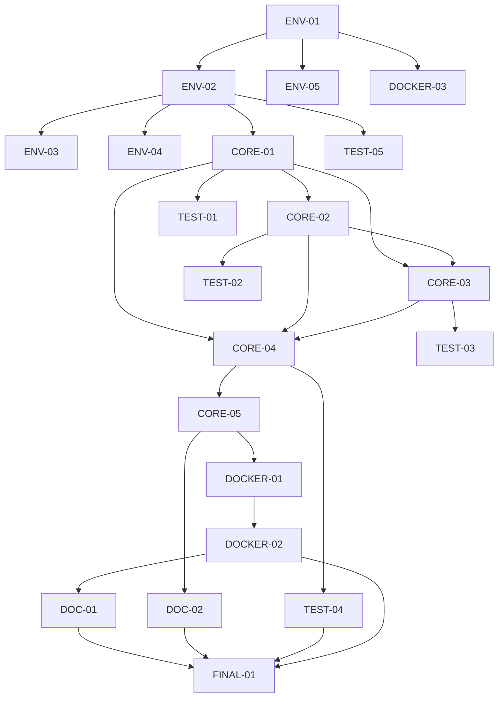

# Discord Voice Diary Bot - Implementation Tasks

## Task Overview

This document outlines the implementation tasks for the Discord Voice Diary Bot project, organized by priority and dependencies.

## Phase 1: Development Environment Setup

### ENV-01: Project Structure Creation
**Priority**: High | **Status**: Pending | **Dependencies**: None

Create the basic project directory structure:
```
voice-diary-bot/
├── .devcontainer/
├── src/
├── tests/
├── assets/
├── pyproject.toml
├── .env.example
├── .gitignore
├── README.md
```

**Acceptance Criteria**:
- [ ] All directories created with proper structure
- [ ] Git repository initialized
- [ ] Basic project files in place

### ENV-02: pyproject.toml Configuration
**Priority**: High | **Status**: Pending | **Dependencies**: ENV-01

Configure uv project with dependencies and development tools:

**Core Dependencies**:
- discord.py
- python-dotenv
- aiohttp

**Development Dependencies**:
- ruff
- mypy
- pytest
- pytest-asyncio
- pre-commit

**Acceptance Criteria**:
- [ ] pyproject.toml configured with all dependencies
- [ ] Tool configurations for ruff, mypy, pytest included
- [ ] Project metadata properly defined

### ENV-03: DevContainer Setup
**Priority**: High | **Status**: Completed | **Dependencies**: ENV-02

Create VSCode devcontainer configuration:

**Files to create**:
- `.devcontainer/devcontainer.json` - VSCode configuration
- `.devcontainer/Dockerfile.dev` - Development container
- `.devcontainer/setup.sh` - Robust setup script

**Acceptance Criteria**:
- [x] DevContainer opens successfully in VSCode
- [x] Python 3.12 environment available
- [x] ffmpeg installed and accessible
- [x] uv package manager functional
- [x] All VSCode extensions loaded
- [x] Pre-commit hooks install successfully
- [x] Robust error handling for setup process

### ENV-04: Pre-commit Configuration
**Priority**: Medium | **Status**: Completed | **Dependencies**: ENV-02

Setup pre-commit hooks for code quality:

**Files to create**:
- `.pre-commit-config.yaml`

**Hooks to configure**:
- ruff (linting and formatting)
- mypy (type checking)

**Acceptance Criteria**:
- [x] Pre-commit hooks installed successfully
- [x] Hooks run on git commit
- [x] All quality checks pass

### ENV-05: Environment Configuration
**Priority**: Medium | **Status**: Pending | **Dependencies**: ENV-01

Create environment configuration templates:

**Files to create**:
- `.env.example` - Environment variable template
- `.gitignore` - Git ignore patterns

**Acceptance Criteria**:
- [ ] .env.example contains all required variables
- [ ] .gitignore excludes sensitive files
- [ ] Environment loading works correctly

## Phase 2: Core Component Implementation

### CORE-01: Settings Module
**Priority**: High | **Status**: Pending | **Dependencies**: ENV-02

Implement `src/settings.py` for configuration management:

**Key Features**:
- Environment variable loading with python-dotenv
- Configuration validation
- Type-safe settings with dataclass
- Default value management

**Configuration Parameters**:
- DISCORD_TOKEN (required)
- CHANNEL_ID (required)
- WORK_DIR (default: /work)
- BACKGROUND_IMAGE (default: /work/assets/bg.jpg)
- DELETE_ON_SUCCESS (default: false)
- AUDIO_BITRATE (default: 96, range: 64-128)
- MAX_FILE_SIZE (default: 25MB)
- PROCESSING_TIMEOUT (default: 300s)

**Acceptance Criteria**:
- [ ] Settings class with proper type annotations
- [ ] Environment variable loading and validation
- [ ] Error handling for missing required variables
- [ ] Audio bitrate validation (64-128 range)
- [ ] All default values properly configured

### CORE-02: Storage Module
**Priority**: High | **Status**: Pending | **Dependencies**: CORE-01

Implement `src/storage.py` for file management:

**Key Features**:
- Path generation for inbox and output files
- Directory structure management
- File cleanup functionality
- File information utilities

**Directory Structure**:
```
/work/
├── inbox/          # Temporary audio downloads
├── out/            # Generated MP4 videos
└── assets/         # Static resources (bg.jpg)
```

**Acceptance Criteria**:
- [ ] StorageManager class implementation
- [ ] Path generation methods for inbox/output
- [ ] Directory creation and validation
- [ ] File cleanup with configurable deletion
- [ ] File existence and size checking

### CORE-03: FFmpeg Runner Module
**Priority**: High | **Status**: Pending | **Dependencies**: CORE-01, CORE-02

Implement `src/ffmpeg_runner.py` for media processing:

**Key Features**:
- Async FFmpeg command execution
- Configurable audio bitrate (64-128 kbps)
- Process timeout and error handling
- Output validation

**FFmpeg Command Template**:
```bash
ffmpeg -y \
  -loop 1 -i {background_image} \
  -i {input_audio} \
  -c:v libx264 -tune stillimage -pix_fmt yuv420p \
  -c:a aac -b:a {audio_bitrate}k -ac 1 \
  -shortest \
  -movflags +faststart \
  {output_video}
```

**Acceptance Criteria**:
- [ ] FFmpegRunner class with async interface
- [ ] Configurable audio bitrate parameter
- [ ] Command building with proper parameter substitution
- [ ] Process execution with timeout handling
- [ ] Output file validation
- [ ] Comprehensive error handling and logging

### CORE-04: Discord Bot Module
**Priority**: High | **Status**: Pending | **Dependencies**: CORE-01, CORE-02, CORE-03

Implement `src/bot.py` for Discord integration:

**Key Features**:
- Discord event handling (on_message)
- Channel filtering by ID
- Audio attachment detection and download
- File processing coordination
- User notification (success/error messages)

**Event Flow**:
1. Message detection in specified channel
2. Audio attachment validation
3. File download to inbox
4. FFmpeg conversion
5. User notification
6. Optional cleanup

**Acceptance Criteria**:
- [ ] VoiceDiaryBot class implementation
- [ ] Discord client setup with proper intents
- [ ] Channel ID filtering
- [ ] Audio attachment detection (audio/* content types)
- [ ] File size validation (≤25MB)
- [ ] Async file download with aiohttp
- [ ] Integration with FFmpegRunner
- [ ] Success/error message responses
- [ ] Proper error handling and logging

### CORE-05: Main Module and Entry Point
**Priority**: Medium | **Status**: Pending | **Dependencies**: CORE-04

Implement main application entry point:

**Files to create**:
- `src/__init__.py`
- `src/__main__.py` or update bot.py with main()

**Key Features**:
- Application initialization
- Configuration loading
- Bot startup and shutdown
- Signal handling for graceful shutdown

**Acceptance Criteria**:
- [ ] Main entry point configured
- [ ] Settings initialization
- [ ] Bot lifecycle management
- [ ] Graceful shutdown handling
- [ ] Proper logging setup

## Phase 3: Testing Implementation

### TEST-01: Unit Tests for Settings
**Priority**: Medium | **Status**: Pending | **Dependencies**: CORE-01

Implement `tests/unit/test_settings.py`:

**Test Cases**:
- Environment variable loading
- Configuration validation
- Default value assignment
- Error handling for missing variables
- Audio bitrate range validation

**Acceptance Criteria**:
- [ ] All settings functionality tested
- [ ] Edge cases covered
- [ ] Mock environment variables
- [ ] 100% code coverage for settings module

### TEST-02: Unit Tests for Storage
**Priority**: Medium | **Status**: Pending | **Dependencies**: CORE-02

Implement `tests/unit/test_storage.py`:

**Test Cases**:
- Path generation
- Directory creation
- File cleanup functionality
- File information utilities

**Acceptance Criteria**:
- [ ] All storage operations tested
- [ ] Temporary directories for testing
- [ ] File system mocking where appropriate
- [ ] Error condition testing

### TEST-03: Unit Tests for FFmpeg Runner
**Priority**: High | **Status**: Pending | **Dependencies**: CORE-03

Implement `tests/unit/test_ffmpeg_runner.py`:

**Test Cases**:
- Command generation with different parameters
- Process execution mocking
- Timeout handling
- Error condition simulation
- Output validation

**Acceptance Criteria**:
- [ ] FFmpeg command building tested
- [ ] Async execution tested with mocks
- [ ] Timeout scenarios covered
- [ ] Error handling validated
- [ ] Different audio bitrate configurations tested

### TEST-04: Integration Tests
**Priority**: Medium | **Status**: Pending | **Dependencies**: CORE-04

Implement `tests/integration/test_bot_integration.py`:

**Test Cases**:
- End-to-end file processing
- Discord bot mocking
- File system integration
- Error scenarios

**Test Fixtures**:
- Sample audio files
- Test background image
- Mock Discord messages

**Acceptance Criteria**:
- [ ] Complete workflow testing
- [ ] Real file processing (with small test files)
- [ ] Discord.py mocking
- [ ] Integration between all components

### TEST-05: Test Infrastructure
**Priority**: Low | **Status**: Pending | **Dependencies**: ENV-02

Setup testing infrastructure:

**Files to create**:
- `tests/conftest.py` - Pytest configuration
- `tests/fixtures/` - Test data directory

**Test Data**:
- Small sample audio files (m4a, mp3)
- Test background image
- Mock configuration files

**Acceptance Criteria**:
- [ ] Pytest configuration complete
- [ ] Test fixtures available
- [ ] Test data properly organized
- [ ] CI/CD compatibility

## Phase 4: Docker and Deployment

### DOCKER-01: Production Dockerfile
**Priority**: Medium | **Status**: Pending | **Dependencies**: CORE-05

Create production Dockerfile:

**Features**:
- Multi-stage build
- Python 3.12 slim base
- FFmpeg installation
- Non-root user execution
- Optimized layer caching

**Acceptance Criteria**:
- [ ] Multi-stage Dockerfile implemented
- [ ] FFmpeg properly installed
- [ ] uv dependency installation
- [ ] Non-root user configuration
- [ ] Work directory setup
- [ ] Asset file placement

### DOCKER-02: Docker Compose Configuration
**Priority**: Medium | **Status**: Pending | **Dependencies**: DOCKER-01

Create `docker-compose.yml`:

**Features**:
- Service configuration
- Volume mounting
- Environment file integration
- Health checks
- Restart policies

**Acceptance Criteria**:
- [ ] Docker Compose file complete
- [ ] Volume mapping for /work directory
- [ ] Environment variable loading
- [ ] Health check implementation
- [ ] Proper restart policy

### DOCKER-03: Default Assets
**Priority**: Low | **Status**: Pending | **Dependencies**: ENV-01

Provide default background image:

**Files to create**:
- `assets/bg.jpg` - Default background image

**Acceptance Criteria**:
- [ ] Default background image provided
- [ ] Image optimized for video generation
- [ ] Proper resolution and format
- [ ] Asset properly integrated in containers

## Phase 5: Documentation and Finalization

### DOC-01: README Documentation
**Priority**: Medium | **Status**: Pending | **Dependencies**: DOCKER-02

Create comprehensive README.md:

**Sections**:
- Project overview
- Quick start guide
- Development setup
- Configuration options
- Docker deployment
- Troubleshooting

**Acceptance Criteria**:
- [ ] Complete setup instructions
- [ ] Configuration documentation
- [ ] Usage examples
- [ ] Troubleshooting guide

### DOC-02: Code Documentation
**Priority**: Low | **Status**: Pending | **Dependencies**: CORE-05

Add inline documentation:

**Requirements**:
- Docstrings for all public methods
- Type annotations throughout
- Code comments for complex logic

**Acceptance Criteria**:
- [ ] All public APIs documented
- [ ] Type annotations complete
- [ ] Complex algorithms explained
- [ ] API documentation generated

### FINAL-01: End-to-End Validation
**Priority**: High | **Status**: Pending | **Dependencies**: All previous tasks

Complete system validation:

**Validation Steps**:
1. DevContainer environment setup
2. Discord bot deployment
3. Audio file processing test
4. Error handling verification
5. Performance validation

**Acceptance Criteria**:
- [ ] Complete workflow functional
- [ ] All acceptance criteria met
- [ ] Performance requirements satisfied
- [ ] Error handling robust
- [ ] Documentation complete

## Task Dependencies



## Implementation Priority

### Sprint 1 (Development Environment)
1. ENV-01: Project Structure Creation
2. ENV-02: pyproject.toml Configuration
3. ENV-03: DevContainer Setup
4. ENV-05: Environment Configuration

### Sprint 2 (Core Components)
1. CORE-01: Settings Module
2. CORE-02: Storage Module
3. CORE-03: FFmpeg Runner Module
4. CORE-04: Discord Bot Module

### Sprint 3 (Testing & Validation)
1. TEST-01: Unit Tests for Settings
2. TEST-03: Unit Tests for FFmpeg Runner
3. TEST-02: Unit Tests for Storage
4. TEST-04: Integration Tests

### Sprint 4 (Deployment & Finalization)
1. DOCKER-01: Production Dockerfile
2. DOCKER-02: Docker Compose Configuration
3. DOC-01: README Documentation
4. FINAL-01: End-to-End Validation

## Success Metrics

- [ ] All unit tests pass with >90% coverage
- [ ] Integration tests validate complete workflow
- [ ] Docker containers build and run successfully
- [ ] DevContainer environment fully functional
- [ ] Audio processing completes within 60 seconds for typical files
- [ ] Bot handles 10 consecutive uploads without failure
- [ ] Error handling provides meaningful user feedback
- [ ] Documentation enables independent setup
